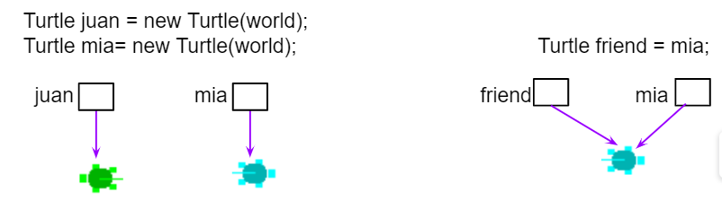

.. include:: ../common.rst

.. qnum::
   :prefix: 3-1-
   :start: 1

.. index::
   single: Boolean
   pair: Variable; boolean
   pair: boolean; variable
   single: and
   single: or
   single: truth table
   pair: logical; and
   pair: logical; or
   single: compound boolean
   single: De Morgan's Laws
   single: negation

Boolean Expressions
===================

**Boolean** variables or expressions can only have **true** or **false** values.

The ``boolean`` data type can represent only two values: ``true`` and ``false``.
The data type is named for `George Boole
<https://en.wikipedia.org/wiki/George_Boole>`_, a 19th century English
mathematician who invented Boolean algebra, a system for dealing with statements
made up of only true and false values.

.. note::

   Some languages use 0 to represent false and 1 to represent true, but Java
   uses the ``boolean`` data type and the two literal values ``true`` and
   ``false`` which are not interchangable with numbers or any other data type.

Testing Equality (==)
----------------------

Java uses the operator ``==`` to test if the value on the left is equal to the
value on the right and ``!=`` to test if two items are not equal. Don't get one
equal sign ``=`` confused with two equal signs ``==``. They mean very different
things in Java. One equal sign is used to assign a value to a variable. Two
equal signs are used to test a variable to see if it is a certain value and that
returns true or false as you'll see below. Also note that using ``==`` and
``!=`` with ``double`` values can produce surprising results. Because ``double``
values are only an approximation of the real numbers even things that should be
mathematically equivalent might not be represented by the exactly same
``double`` value and thus will not be ``==``. To see this for yourself, write a
line of code below to print the value of the expression ``0.3 == 0.1 + 0.2``; it
will be ``false``!

The operators ``==`` and ``!=`` (not equal) can be used to compare values. They return true or false boolean values.

.. note::

    One ``=`` sign changes the value of a variable. Two ``==`` equal signs are used to test if a variable holds a certain value, without changing its value!

.. |Colleen video| raw:: html

   <a href="https://www.youtube.com/watch?v=bO9bejT0jwE&list=PLHqz-wcqDQIEP6p1_0wOb9l9aQ0qFijrP&ab_channel=colleenlewis" target="_blank">video</a>

Watch the following |Colleen video| which shows what happens in memory as primitive types like ``int`` and reference types like ``Dog`` are compared with ``==`` in a physical model of Java memory.

.. youtube:: bO9bejT0jwE
    :width: 650
    :height: 415
    :align: center
    :optional:

The following code shows how ``==`` is used with primitive types like ``int``.

.. activecode:: bool1
   :language: java
   :autograde: unittest

   What will the code below print out? Try to guess before you run it! Note that 1 equal sign (``=``) is used for assigning a value and 2 equal signs (``==``) for testing values.
   ~~~~
   public class BoolTest1
   {
       public static void main(String[] args)
       {
           int age = 15;
           int year = 14;
           // Will this print true or false?
           System.out.println(age == year);
           year = 15;
           // Will this print true or false?
           System.out.println(age == year);
           // Will this print true or false?
           System.out.println(age != year);
       }
   }

   ====
   // should pass if/when they run code
   import static org.junit.Assert.*;

   import org.junit.*;

   import java.io.*;

   public class RunestoneTests extends CodeTestHelper
   {
       @Test
       public void testMain() throws IOException
       {
           String output = getMethodOutput("main");
           String expect = "false\ntrue\nfalse\n";
           boolean passed = getResults(expect, output, "Expected output from main", true);
           assertTrue(passed);
       }
   }

We can also use ``==`` or ``!=`` to test if two reference values, like ``Turtle`` and ``String`` objects,  refer to the same object. In the figure below, we are creating two separate ``Turtle`` objects called ``juan`` and ``mia``. They do not refer to same object or turtle. Then, we create a reference variable called ``friend`` that is set to ``mia``. The turtle ``mia`` will have two ways (**references** or **aliases**) to name her -- she's both ``mia`` and ``friend``, and these variables refer to the same object (same ``Turtle``) in memory. If two reference  variables refer to the same object like the turtle on the right in the image below, the test with ``==`` will return true which you can see in the code below.

    Figure 1: Turtle Reference Equality

|CodingEx| **Coding Exercise**

.. activecode:: boolRef
   :language: java
   :datafile: turtleClasses.jar
   :autograde: unittest

   What will the code below print out? Try to guess before you run it!
   ~~~~
   import java.awt.*;
   import java.util.*;

   public class BoolTestRef
   {
       public static void main(String[] args)
       {
           World world = new World(300, 300);
           Turtle juan = new Turtle(world);
           Turtle mia = new Turtle(world);

           // Will these print true or false?
           System.out.println(juan == mia);
           Turtle friend = mia; // set friend to be an alias for mia
           System.out.println(friend == mia);
       }
   }

    ====
    import static org.junit.Assert.*;

    import org.junit.*;

    import java.io.*;

    public class RunestoneTests extends CodeTestHelper
    {
        public RunestoneTests()
        {
            super("BoolTestRef");
        }

        @Test
        public void test1()
        {
            boolean passed = getResults("true", "true", "main()");
            assertTrue(passed);
        }
    }

Relational Operators (<, >)
----------------------------

The **Relational Operators** below in Java are used to compare numeric values or arithmetic expressions. Although some programming languages allow using relational operators like ``<`` to compare strings, Java only uses these operators for numbers, and uses the methods ``compareTo`` and ``equals`` for comparing ``String`` values.

- ``<`` Less Than
- ``>`` Greater Than
- ``<=`` Less than or equal to
- ``>=`` Greater than or equal to
- ``==`` Equals
- ``!=`` Does not equal

If you have trouble telling ``<`` and ``>`` apart, think of ``<`` and ``>`` as
arrows where the pointy end should point to the smaller value. If ``<`` (less
than) points towards a smaller number on the left, then it evaluates to
``true``. On the other hand a ``>`` (greater than) expression will be ``true``
only if the smaller number is on the right hand side. Or maybe you prefer the
“hungry alligator” mnemonic beloved by elementary school teachers—think of ``<``
and ``>`` as the mouths of hungry alligators which always want to eat the bigger
number; a ``<`` or ``>`` expression is only ``true`` if the alligator is in fact
about to eat the bigger number.

To remember the correct order of the two characters in ``<=`` and ``>=``, just
write them in the same order you would say them in English: “less than or equal
to” not “equal to or less than”.

|CodingEx| **Coding Exercise**

.. activecode:: bool2
   :language: java
   :autograde: unittest

   Try to guess what the code below will print out before you run it.
   ~~~~
   public class BoolTest2
   {
       public static void main(String[] args)
       {
           int age = 15;
           int year = 14;
           // Will these print true or false?
           System.out.println(age < year);
           System.out.println(age > year);
           System.out.println(age <= year + 1);
           System.out.println(age - 1 >= year);
       }
   }

   ====
   import static org.junit.Assert.*;

   import org.junit.*;

   import java.io.*;

   public class RunestoneTests extends CodeTestHelper
   {
       @Test
       public void testMain() throws IOException
       {
           String output = getMethodOutput("main");
           String expect = "false\ntrue\ntrue\ntrue\n";
           boolean passed = getResults(expect, output, "Expected output from main", true);
           assertTrue(passed);
       }
   }

|Exercise| **Check your understanding**

.. dragndrop:: BooleanExps
    :feedback: Review the relational operators above.
    :match_1: x > 0|||x is positive
    :match_2: x == y|||x equals y
    :match_3: x < 0|||x is negative
    :match_4: x != y|||x does not equal y
    :match_5: x < y |||x is less than y
    :match_6: x > y |||x is greater than y
    :match_7: x >= y |||x is greater than or equal to y

    Drag the boolean expression from the left and drop it on what it is testing on the right.  Click the "Check Me" button to see if you are correct.

Testing with remainder (%)
---------------------------

Here are some boolean expressions that are very useful in coding and remainder is used in many of them:

.. code-block:: java

  // Test if a number is positive
  (number > 0)
  //Test if a number is negative
  (number < 0)
  //Test if a number is even by seeing if the remainder is 0 when divided by 2
  (number % 2 == 0)
  //Test if a number is odd by seeing if there is a remainder when divided by 2
  (number % 2 > 0)
  //Test if a number is a multiple of x (or divisible by x with no remainder)
  (number % x == 0)

.. activecode:: boolMod
   :language: java
   :autograde: unittest

   Try the expressions containing the % operator below to see how they can be used to check for even or odd numbers. All even numbers are divisible (with no remainder) by 2.
   ~~~~
   public class BoolMod
   {
       public static void main(String[] args)
       {
           int age1 = 15;
           int age2 = 16;
           int divisor = 2;
           System.out.println(
                   "Remainder of "
                           + age1
                           + "/"
                           + divisor
                           + " is "
                           + (age1 % divisor));
           System.out.println(
                   "Remainder of "
                           + age2
                           + "/"
                           + divisor
                           + " is "
                           + (age2 % divisor));
           System.out.println("Is " + age1 + " even? " + (age1 % 2 == 0));
           System.out.println("Is " + age2 + " even? " + (age2 % 2 == 0));
       }
   }

   ====
   import static org.junit.Assert.*;

   import org.junit.*;

   import java.io.*;

   public class RunestoneTests extends CodeTestHelper
   {
       @Test
       public void testMain() throws IOException
       {
           String output = getMethodOutput("main");
           String expect =
                   "Remainder of 15/2 is 1\n"
                       + "Remainder of 16/2 is 0\n"
                       + "Is 15 even? false \n"
                       + "Is 16 even? true\n";
           boolean passed = getResults(expect, output, "Expected output from main", true);
           assertTrue(passed);
       }
   }

The **remainder** operator has been used quite a bit on the AP CSA exam, so you should be familiar with it.

- Use it to check for odd or even numbers. If ``num % 2 != 0`` is true, ``num``
  is odd and if ``num % 2 == 0`` is true then ``num`` is even.

- You can also use remainder to check if any number is evenly divisible by any
  other: If ``num1 % num2 == 0`` is true then ``num1`` is evenly divisible by
  ``num2``.

- Use it to get the last digit from an integer number: ``num % 10`` gives us the
  rightmost digit of ``num``.

- Use it to get the number of minutes left when you convert a total number of minutes to hours and minutes:

  .. code:: java

     int totalMinutes = 345;
     int hours = totalMinutes / 60;   // Number of whole hours, i.e. 5
     int minutes = totalMinutes % 60; // Number of minutes left over, i.e. 45

- Use it whenever you have limit in the value, and you need to wrap around to
  zero if the value goes over the limit: the value of ``num % limit`` will
  always be in the range from 0 (inclusive) to ``limit`` (exclusive) as long as
  ``num`` and ``limit`` are both positive.

.. note::

  A warning: because Java's ``%`` is a remainder operator and not a true
  mathematical modulo operator (as we discussed briefly in section 1.4) you
  can’t check if a number is odd with the expression ``num % 2 == 1``.

  That expression will be ``true`` if ``num`` is positive and odd and ``false``
  when ``num`` is even, both of which are correct. But if ``num`` is negative
  and odd, its remainder when divided by 2 is -1, not 1 and this expression will
  evaluate to ``false``. Thus you should always use ``num % 2 != 0`` to check if
  ``num`` is odd.

|Groupwork| Programming Challenge : Prime Numbers POGIL
-------------------------------------------------------

.. |pogil| raw:: html

   <a href="https://pogil.org/about-pogil/what-is-pogil" target="_blank">POGIL</a>

.. |pogil role| raw:: html

   <a href="https://docs.google.com/document/d/1_NfNLWJxaG4qZ2Jd2x8UctDS05twn1h6p-o3XaAcRv0/edit?usp=sharing" target="_blank">POGIL role</a>

.. |Numberphile video| raw:: html

   <a href="https://www.youtube.com/watch?v=M7kEpw1tn50" target="_blank">Numberphile video</a>

We encourage you to do this activity as a |POGIL| (Process Oriented Guided Inquiry Learning) group activity or using Think-Pair-Share collaboration. POGIL groups are self-managed teams of 4 students where everyone has a |pogil role| and works together to solve the problems, making sure that everyone in the team participates and learns.

In this activity, you will use boolean expressions to explore prime numbers. A prime number is an integer number that is only divisible by 1 and itself. For example, 3 is a prime number because it's only divisible by 1 and 3 and no other numbers, but 4 is not a prime number because it's divisible by 2 as well as 1 and 4.

Prime numbers are very useful in encryption algorithms because they can be used as keys for encoding and decoding. If you have the key, you can use it to divide a large number that represents something encrypted to decode it, but if you don't have the key, it's very hard to guess the factors of a large number to decode it. If you're curious about this, watch this |Numberphile video|.

The following program checks if 5 is a prime number by seeing if it is divisible by the numbers 1 - 5. Run the code, and then answer the following questions.

    1. Is 5 a prime number?
    2. What boolean tests determine that a number is prime?
    3. Change the number to 6 and add more boolean expressions to determine if 6 is prime. Is 6 prime?
    4. Change the number to 7 and add more boolean expressions to determine if 7 is prime. Is 7 prime?
    5. If you changed the boolean expressions to use <= instead of ==, would the code still help you to find prime numbers? Why or why not? Experiment and find out.
    6. If you changed the boolean expressions to use >= instead of ==, would the code still help you to find prime numbers? Why or why not? Experiment and find out.
    7. Are all odd numbers prime? Can you find one that is not by using boolean expressions in the code below?
    8. Are all even numbers not prime? Can you find an even prime number?

.. activecode:: challenge3-1-primeNumbers
   :language: java
   :autograde: unittest
   :practice: T

   Experiment with the code below changing the value of number and adding more print statements with boolean expressions to determine if the numbers 5, 6, and 7 are prime. Are all odd numbers prime? Are all even numbers not prime?
   ~~~~
   public class PrimeNumbers
   {
       public static void main(String[] args)
       {
           int number = 5;
           System.out.println("A prime number is only divisible by 1 and itself.");
           System.out.println(
                   "Is " + number + " divisible by 1 up to " + number + "?");
           System.out.println("Divisible by 1? " + (number % 1 == 0));
           System.out.println("Divisible by 2? " + (number % 2 == 0));
           System.out.println("Divisible by 3? " + (number % 3 == 0));
           System.out.println("Divisible by 4? " + (number % 4 == 0));
           System.out.println("Divisible by 5? " + (number % 5 == 0));
       }
   }

   ====
   import static org.junit.Assert.*;

   import org.junit.*;

   import java.io.*;

   public class RunestoneTests extends CodeTestHelper
   {
       @Test
       public void testChangedCode()
       {
           String origCode =
                   "public class PrimeNumbers{public static void main(String[] args){int number = 5;"
                       + " System.out.println(\"A prime number is only divisible by 1 and itself.\");"
                       + " System.out.println(\"Is \" + number + \" divisible by 1 up to \" + number +"
                       + " \"?\"); System.out.println(\"Divisible by 1? \" + (number % 1 == 0));"
                       + " System.out.println(\"Divisible by 2? \" + (number % 2 == 0));"
                       + " System.out.println(\"Divisible by 3? \" + (number % 3 == 0));"
                       + " System.out.println(\"Divisible by 4? \" + (number % 4 == 0));"
                       + " System.out.println(\"Divisible by 5? \" + (number % 5 == 0));}}";

           boolean changed = codeChanged(origCode);
           assertTrue(changed);
       }

       @Test
       public void testBool6() throws IOException
       {
           String target = "number % 6 == 0";
           boolean passed = checkCodeContains("boolean check for divisibility by 6", target);
           assertTrue(passed);
       }

       @Test
       public void testBool7() throws IOException
       {
           String target = "number % 7 == 0";
           boolean passed = checkCodeContains("boolean check for divisibility by 7", target);
           assertTrue(passed);
       }
   }

Summary
-------------------

- Primitive values and reference values can be compared using relational operators (i.e., ``==`` and ``!=``) in Java.
- Arithmetic expression values can be compared using relational operators (i.e., ``<``, ``>``, ``<=``, ``>=``) in Java.
- An expression involving relational operators evaluates to a ``boolean`` value of ``true`` or ``false``.

AP Practice
------------

.. mchoice:: AP3-1-1
    :practice: T

    Consider the following statement.

    .. code-block:: java

        boolean x = (5 % 3 == 0) == (3 > 5);

    What is the value of x after the statement has been executed?

    - false

      - Although both sides of the middle == are false, false == false is true! Tricky!

    - true

      + (5 % 3 == 0) is false and (3 > 5) is false, and false == false is true! Tricky!

    - (5 % 3 == 0)

      - The boolean x should hold true or false.

    - (3 > 5)

      - The boolean x should hold true or false.

    - 2

      - The boolean x should hold true or false.

.. mchoice:: AP3-1-2
    :practice: T

    Consider the following Boolean expression in which the int variables x and y have been properly declared and initialized.

    .. code-block:: java

        (x >= 10) == (y < 12)

    Which of the following values for x and y will result in the expression evaluating to true  ?

    - x = 10 and y = 12

      - The left side is true, but y must be less than 12 to make the right side true.

    - x = 9 and y = 9

      - The left side is false (x must be greater than or equal to 10), but the right side is true.

    - x = 10 and y = 11

      + Correct! Both sides are true!

    - x = 10 and y = 13

      - The left side is true, but y must be less than 12 to make the right side true.

    - x = 9 and y = 12

      + Correct! Both sides are false! This is tricky!

Relational Operators Practice Game
-----------------------------------

.. |game| raw:: html

   <a href="https://csa-games.netlify.app/" target="_blank">game</a>

Try the game below to practice. Click on **Relationals**,  evaluate the relational expression and click on None, All, or the numbers that make the expression true. Check on Compound for an added challenge. We encourage you to work in pairs and see how high a score you can get.

.. raw:: html

     <iframe id="page-embed" class="init" height="700px" width="100%" style="margin-left:10%;max-width:80%" src="https://csa-games.netlify.app/"></iframe>

And (&&), Or (||), and Not (!)
--------------------------------

What if you want two things to be true before the body of the conditional is executed?  Use ``&&`` as a logical **and** to join two Boolean expressions and the body of the condition will only be executed only if both are true.

|CodingEx| **Coding Exercise**

.. activecode:: lccc1
   :language: java
   :autograde: unittest

   What if you want to go out and your parents say you can go out if you clean your room and do your homework?  Run the code below and try different values for ``cleanedRoom`` and ``didHomework`` and see what they have to be for it to print ``You can go out``.
   ~~~~
   public class Test1
   {
       public static void main(String[] args)
       {
           boolean cleanedRoom = true;
           boolean didHomework = false;
           if (cleanedRoom && didHomework)
           {
               System.out.println("You can go out");
           }
           else
           {
               System.out.println("No, you can't go out");
           }
       }
   }

   ====
   import static org.junit.Assert.*;

   import org.junit.*;

   import java.io.*;

   public class RunestoneTests extends CodeTestHelper
   {
       @Test
       public void testChangedCode()
       {
           String origCode =
                   "public class Test1 { public static void main(String[] args){ boolean cleanedRoom ="
                       + " true; boolean didHomework = false; if (cleanedRoom && didHomework){"
                       + " System.out.println(\"You can go out\");} else { System.out.println(\"No,"
                       + " you can't go out\");}}}";

           boolean changed = codeChanged(origCode);
           assertTrue(changed);
       }

       @Test
       public void testMain()
       {
           String output = getMethodOutput("main");
           String expect = "You can go out";

           boolean passed = getResults(expect, output, "Expected output from main");
           assertTrue(passed);
       }
   }

What if it is okay if only one of two things is true? Use ``||`` as a logical **or** to join two Boolean expressions and the body of the condition will be executed if one or both are true.

|CodingEx| **Coding Exercise**

.. activecode:: lccc2
   :language: java
   :autograde: unittest

   For example, your parents might say you can go out if you can walk or they don't need the car.  Try different values for ``walking`` and ``carIsAvailable`` and see what the values have to be to print ``You can go out``.
   ~~~~
   public class Test2
   {
       public static void main(String[] args)
       {
           boolean walking = false;
           boolean carIsAvailable = false;
           if (walking || carIsAvailable)
           {
               System.out.println("You can go out");
           }
           else
           {
               System.out.println("No, you can't go out");
           }
       }
   }

   ====
   import static org.junit.Assert.*;

   import org.junit.*;

   import java.io.*;

   public class RunestoneTests extends CodeTestHelper
   {
       @Test
       public void testChangedCode()
       {
           String origCode =
                   "public class Test2 { public static void main(String[] args){ boolean walking ="
                       + " false; boolean carIsAvailable = false; if (walking || carIsAvailable) {"
                       + " System.out.println(\"You can go out\"); } else{System.out.println(\"No, you"
                       + " can't go out\"); }}}";

           boolean changed = codeChanged(origCode);
           assertTrue(changed);
       }

       @Test
       public void testMain()
       {
           String output = getMethodOutput("main");
           String expect = "You can go out";

           boolean passed = getResults(expect, output, "Expected output from main");
           assertTrue(passed);
       }
   }

.. note::

    In English, we often use an exclusive-or like in the sentence "do you want to be player 1 *or* player 2?" where you can't be both player 1 and player 2. In programming, the or-operator is an inclusive-or which means that the whole expression is true if either one or the other or *both* conditions are true.

With numerical values, the **or** (||) operator is often used to check for error conditions on different ends of the number line, while the **and** (&&) operator is often used to see if a number is in an range.

|CodingEx| **Coding Exercise**

.. activecode:: lcccnum
   :language: java
   :autograde: unittest

   Explore how && and || are used with numbers below. Try different values for score like -10 and 110 in the code below.
   ~~~~
   public class TestNum
   {
       public static void main(String[] args)
       {
           int score = 10; // Try -10 and 110
           if (score < 0 || score > 100)
           {
               System.out.println("Score has an illegal value.");
           }
           if (score >= 0 && score <= 100)
           {
               System.out.println("Score is in the range 0-100");
           }
       }
   }

   ====
   import static org.junit.Assert.*;

   import org.junit.*;

   import java.io.*;

   public class RunestoneTests extends CodeTestHelper
   {
       @Test
       public void testChangedCode()
       {
           String origCode =
                   "public class TestNum{public static void main(String[] args){int score = 10;  if"
                       + " (score < 0 || score > 100){ System.out.println(\"Score has an illegal"
                       + " value.\");}if (score >= 0 && score <= 100){ System.out.println(\"Score is"
                       + " in the range 0-100\");}}}";

           boolean changed = codeChanged(origCode);
           assertTrue(changed);
       }
   }

The **not** (``!``) operator can be used to negate a boolean value. We've seen ``!`` before in ``!=`` (not equal).  If you use ``!`` in expressions with ``&&`` and ``||``, be careful because the results are often the opposite of what you think it will be at first. We'll see examples of this in the next lesson.

|CodingEx| **Coding Exercise**

.. activecode:: lcccnot
   :language: java
   :autograde: unittest

   The code below says if homework is not done, you can't go out. Try different values for ``homeworkDone``.
   ~~~~
   public class TestNot
   {
       public static void main(String[] args)
       {
           boolean homeworkDone = false;
           if (!homeworkDone)
           {
               System.out.println("Sorry, you can't go out!");
           }
       }
   }

   ====
   import static org.junit.Assert.*;

   import org.junit.*;

   import java.io.*;

   public class RunestoneTests extends CodeTestHelper
   {
       @Test
       public void testChangedCode()
       {
           String origCode =
                   "public class TestNot{public static void main(String[] args){ boolean homeworkDone"
                       + " = false; if (!homeworkDone) { System.out.println(\"Sorry, you can't go"
                       + " out!\"); } } }";

           boolean changed = codeChanged(origCode);
           assertTrue(changed);
       }
   }

.. note::

    In Java, ! will be executed before &&, and && will be executed before ||, unless there are parentheses. Anything inside parentheses is executed first.

Truth Tables
------------

The following table (also called a **truth table**) shows the result for ``P && Q`` when ``P`` and ``Q`` are both expressions that can be ``true`` or ``false``. An expression involving logical operators like ``P && Q`` evaluates to a ``boolean`` value, ``true`` or ``false``. As you can see below the result of ``P && Q`` is only ``true`` if both ``P`` and ``Q`` are ``true``.

+-------+-------+-----------+
| P     | Q     | P && Q    |
+=======+=======+===========+
|true   |true   |true       |
+-------+-------+-----------+
|false  |true   |false      |
+-------+-------+-----------+
|true   |false  |?          |
+-------+-------+-----------+
|false  |false  |false      |
+-------+-------+-----------+

|Exercise| **Check your understanding**

.. fillintheblank:: 3_5_1_trueAndFalse

   The truth table above is missing one result.  What is the result of ``P && Q`` when ``P=true`` and ``Q=false``?

   -    :^false$: Correct.  Both values must be true for && to return true.
        :.*: Try it and see

The following table shows the result for ``P || Q`` when ``P`` and ``Q`` are both expressions that can be ``true`` or ``false``.  As you can see below the result of ``P || Q`` is ``true`` if either ``P`` or ``Q`` is ``true``.  It is also ``true`` when both of them are ``true``.

+-------+-------+-----------+
| P     | Q     | P || Q    |
+=======+=======+===========+
|true   |true   |true       |
+-------+-------+-----------+
|false  |true   |?          |
+-------+-------+-----------+
|true   |false  |true       |
+-------+-------+-----------+
|false  |false  |false      |
+-------+-------+-----------+

|Exercise| **Check your understanding**

.. fillintheblank:: 3_5_2_falseOrTrue

   The truth table above is missing one result.  What is the result of ``P || Q`` when ``P=false`` and ``Q=true``?

   -    :^true$: Correct.  Only one of the two has to be true with || so this will print true.
        :.*: Try it and see

|Exercise| **Check your understanding**

.. mchoice:: qcbc_7
   :practice: T
   :answer_a: first case
   :answer_b: second case
   :correct: a
   :feedback_a: first case will print if both of the conditions are true and they are.
   :feedback_b: second case will print either of the conditions are false.

   What is printed when the following code executes and x has been set to 3 and y has been set to 9?

   .. code-block:: java

     if (x > 0 && (y / x) == 3)
     {
        System.out.println("first case");
     }
     else
     {
        System.out.println("second case");
     }

.. mchoice:: qcbc_8
   :practice: T
   :answer_a: first case
   :answer_b: second case
   :correct: b
   :feedback_a: first case will print if both of the conditions are true, but the second is not.
   :feedback_b: second case will print if either of the conditions are false and the second one is (6 / 3 == 2).

   What is printed when the following code executes and x has been set to 3 and y has been set to 6?

   .. code-block:: java

     if (x > 0 && (y / x) == 3)
     {
        System.out.println("first case");
     }
     else
     {
        System.out.println("second case");
     }

.. mchoice:: qcbc_or
   :practice: T
   :answer_a: first case
   :answer_b: second case
   :correct: a
   :feedback_a: first case will print if either of the two conditions are true.  The first condition is true, even though the second one isn't.
   :feedback_b: second case will print if both of the conditions are false, but the first condition is true.

   What is printed when the following code executes and x has been set to 3 and y has been set to 6?  Notice that it is now an **or** (||) instead of **and** (&&).

   .. code-block:: java

     if (x > 0 || (y / x) == 3)
     {
        System.out.println("first case");
     }
     else
     {
        System.out.println("second case");
     }

Short Circuit Evaluation
------------------------

.. index::
   single: short circuit evaluation
   pair: conditional; short circuit evaluation

Both ``&&`` and ``||`` use **short circuit evaluation**.  That means that the second expression (on the right of the operator) isn't necessarily checked, if the result from the first expression is enough to tell if the compound boolean expression is true or false:

- If two boolean values/expressions are combined with a logical **or** (``||``) and the first expression is ``true``, then the second expression won’t be executed, since only one needs to be ``true`` for the result to be ``true``.
- If two boolean values/expressions are combined with a logical **and** (``&&``) and the first expression is ``false``, then the second expression won't be executed.  If the first expression is ``false``, the result will be ``false``, since both sides of the ``&&`` need to be ``true`` for the result to be ``true``.

|Exercise| **Check your understanding**

.. mchoice:: qcbc_5
   :practice: T
   :answer_a: first case
   :answer_b: second case
   :answer_c: You will get a error because you can't divide by zero.
   :correct: b
   :feedback_a: first case will only print if x is greater than 0 and it is not.
   :feedback_b: second case will print if x is less than or equal to zero or if y divided by x is not equal to 3.
   :feedback_c: Since the first condition is false when x is equal to zero the second condition won't execute.  Execution moves to the else.

   What is printed when the following code executes and x has been set to 0 and y to 3?

   .. code-block:: java

     if (x > 0 && (y / x) == 3)
     {
        System.out.println("first case");
     }
     else
     {
        System.out.println("second case");
     }

.. mchoice:: qcb_7sc
   :practice: T
   :answer_a: first case
   :answer_b: second case
   :answer_c: You will get a error because you can't divide by zero.
   :correct: a
   :feedback_a: Since x is equal to zero the first expression in the complex conditional will be true and the (y / x) == 3 won't be evaluated, so it won't cause a divide by zero error.  It will print "first case".
   :feedback_b: Since x is equal to zero the first part of the complex conditional is true so it will print first case.
   :feedback_c: You won't get an error because of short circuit evaluation.  The (y / x) == 3 won't be evaluated since the first expression is true and an or is used.

   What is printed when the following code executes and x has been set to zero and y is set to 3?

   .. code-block:: java

     if (x == 0 || (y / x) == 3)
     {
        System.out.println("first case");
     }
     else
     {
        System.out.println("second case");
     }

|Groupwork| Programming Challenge : Truth Tables POGIL
------------------------------------------------------

.. |pogil| raw:: html

   <a href="https://pogil.org/about-pogil/what-is-pogil" target="_blank" style="text-decoration:underline">POGIL</a>

.. |pogil role| raw:: html

   <a href="https://docs.google.com/document/d/1_NfNLWJxaG4qZ2Jd2x8UctDS05twn1h6p-o3XaAcRv0/edit?usp=sharing" target="_blank" style="text-decoration:underline">POGIL role</a>

.. |venn diagram| raw:: html

   <a href="https://docs.google.com/document/d/1lpjk0LS_KdAddRurMayJZmaFzeyEg4FyhviZcSTXvtU/edit?usp=sharing" target="_blank" style="text-decoration:underline">Venn diagram</a>

We encourage you to do this activity as a |POGIL| (Process Oriented Guided Inquiry Learning) group activity. POGIL groups are self-managed teams of up to 4 students where everyone has a |pogil role| and works together to solve the problems, making sure that everyone in the team participates and learns.

Explore the following problems with your group:

1. Draw or print a |Venn diagram| of 4 intersecting circles. Put the names of the 4 people in your group one in each circle. Write down the age of each person in your group in the circles. If two or more people are the same age, put the age in the intersecting parts of their circles. Write a Boolean expression that compares the age of each person in the group using ``==``, ``<``, ``>``, and ``&&``, for example Ada's age ``>`` Alan's age ``&&`` Alan's age ``==`` Grace's age. Then, ask each person in your group their favorite movie. If two or more people have the same favorite movie, put the movie in the intersecting parts of their circles. Write a Boolean expression that compares the favorite movies in the group using ``==``, ``!=``, and ``&&``, for example Ada's movie ``==`` Alan's movie ``&&`` Alan's movie ``!=`` Grace's movie. Think of 1 more comparison and write it in the circles and as a Boolean expression. Share the Boolean expressions with the class. (Thank you to Jill Westerlund of Hoover High School and Art Lopez of Sweetwater High School for this activity suggestion).

2. Write the sentence "If it's sunny, OR if the temperature is greater than 80 and it's not raining, I will go to the beach." as a Java if statement using an int variable ``temperature`` and boolean variables ``sunny`` and ``raining``.  If the conditional is true, print out "Go to the beach!". So, you will go to the beach on days that it is sunny in any temperature, or you will go to the beach on days when the temperature is over 80 degrees and it's not raining.

3. Complete a truth table for the if statement that you wrote in #2 with columns for sunny, temperature > 80, raining, and go to the beach.

4. Write Java code below to test your if statement and try all the values in your truth table to see if you filled it out correctly. You will need test case for each of the 8 rows in your truth table, for example when sunny is true and false, when raining is true or false, and for a value of temperature greater than 80, for example 90, and less than 80, for example 60.

.. activecode:: challenge3-5-truthtables
   :language: java
   :autograde: unittest
   :practice: T

   Challenge-3-5-truthtables: Test your boolean expression in an if statement below.
   ~~~~
   public class TruthTable
   {
       public static void main(String[] args)
       {
           // Test multiple values for these variables
           boolean sunny = false;
           int temperature = 90;
           boolean raining = false;

           // Write an if statement for: If it's sunny,
           //  OR if the temperature is greater than 80
           //     and it's not raining, "Go to the beach!"

       }
   }

   ====
   import static org.junit.Assert.*;

   import org.junit.*;

   import java.io.*;

   public class RunestoneTests extends CodeTestHelper
   {
       @Test
       public void testMain() throws IOException
       {
           String expect = "Go to the beach!";
           String output = getMethodOutput("main");
           String code = getCode();
           boolean passed;
           if (getCode().contains("boolean sunny = false"))
               passed =
                       getResults(
                               expect,
                               output,
                               "Prints Go to the beach! with initial input (sunny = false; temperature"
                                   + " = 90; raining = false;)");
           else passed = getResults("sunny = false", "sunny = true", "Set sunny to false to test");

           assertTrue(passed);
       }

       @Test
       public void testCodeContains1()
       {
           boolean ifStatement = checkCodeContains("conditional: if", "if");
           assertTrue(ifStatement);
       }

       @Test
       public void testCodeContains2()
       {
           boolean ifStatement1 =
                   checkCodeContains("conditional: temperature greater than 80", "temperature > 80");

           assertTrue(ifStatement1);
       }

       @Test
       public void testCodeContains4()
       {
           boolean ifStatement3 = checkCodeContains("and", "&&");
           assertTrue(ifStatement3);
       }

       @Test
       public void testCodeContains5()
       {
           boolean ifStatement3 = checkCodeContains("or", "||");
           assertTrue(ifStatement3);
       }
   }

Summary
--------

- Logical operators ``!`` (not), ``&&`` (and), and ``||`` (or) are used with Boolean values.

- ``A && B`` is ``true`` if both ``A`` and ``B`` are ``true``.

- ``A || B`` is ``true`` if either ``A`` or ``B`` (or both) are ``true``.

- ``!A`` is ``true`` if ``A`` is ``false``.

- In Java, ``!`` has precedence (is executed before) ``&&`` which has precedence over ``||``. Parentheses can be used to force the order of execution in a different way.

- When the result of a logical expression using ``&&`` or ``||`` can be determined by evaluating only the first Boolean operand, the second is not evaluated. This is known as **short-circuit evaluation**.

AP Practice
------------

.. mchoice:: AP3-5-1
    :practice: T

    Consider the following code segment. What is printed as a result of executing the code segment?

    .. code-block:: java

        int x = 10;
        int y = 5;

        if (x % 2 == 0 && y % 2 == 0 || x > y)
        {
            System.out.print("First ");

            if (y * 2 == x || y > 5 && x <= 10)
            {
               System.out.print("Second ");
            }
            else
            {
               System.out.print("Third ");
            }
        }

    - Nothing is printed out.

      - Some of these conditions are true.

    - First

      - This is partially correct.

    - Third

      - Third cannot be printed out unless First is printed out first.

    - FirstSecond

      + Good tracing!

    - FirstThird

      - Take another look at the second condition.

Boolean Game
---------------

.. |game| raw:: html

   <a href="https://csa-games.netlify.app/" target="_blank">game</a>

Try the game below written to practice Booleans. Click on **Booleans**, look at the color and number in the block and evaluate the boolean expression to choose true or false. Then, check on Compound for an added challenge. We encourage you to work in pairs and see how high a score you can get.

.. raw:: html

    <iframe height="700px" width="100%" style="margin-left:10%;max-width:80%" src="https://csa-games.netlify.app/"></iframe>
    

.. raw:: html

    

Equivalent Boolean Expressions (De Morgan's Laws)
-------------------------------------------------

What if you heard a rumor about a senior at your high school? And then you heard that the rumor wasn't true - it wasn't a senior at your high school. Which part of "a senior at your high school" wasn't true? Maybe they weren't a senior? Or maybe they didn't go to your high school? You could write this as a logic statement like below using negation (``!``) and the **and** (``&&``) operator since both parts have to be true for the whole statement to be true. (Thank you to Kevin Saxton from Kent School, CT for this example.)

.. code-block:: java

        !(a && b)

        a = "senior"
        b = "at our high school"

        // This means it is not true that (a) it is a senior
        // and (b) someone at our high school.

In this lesson, you will learn about De Morgan's Laws which simplify statements like this. We know that !(a senior at our high school) could mean !(a senior) or !(at our high school). Let's learn more about De Morgan's Laws.

De Morgan's Laws
----------------

De Morgan's Laws were developed by Augustus De Morgan in the 1800s.  They show how to simplify the negation of a complex boolean expression, which is when there are multiple expressions joined by an **and** (``&&``) or **or** (``||``), such as ``(x < 3) && (y > 2)``. When you negate one of these complex expressions, you can simplify it by flipping the operators and end up with an equivalent expression. De Morgan's Laws state the following equivalencies. Here's an easy way to remember De Morgan's Laws: **move the NOT inside, AND becomes OR** and **move the NOT inside, OR becomes AND**.

.. figure:: Figures/demorgan.png
    :width: 400px
    :align: center
    :figclass: align-center

    Figure 1: De Morgan's Laws to simplify complex expressions

In Java, De Morgan's Laws are written with the following operators:

    -  ``!(a && b)`` is equivalent to ``!a || !b``

    -  ``!(a || b)`` is equivalent to ``!a && !b``

Going back to our example above, !(a senior && at our high school) is equivalent to !(a senior) or !(at our high school) using De Morgan's Laws:

.. code-block:: java

        !(a && b) is equivalent to !a || !b

        a = "senior"
        b = "at our high school"

You can also simplify negated boolean expressions that have relational operators like ``<``, ``>``, ``==``. You can move the negation inside the parentheses by flipping the relational operator to its opposite sign. For example, not (c equals d) is the same as saying c does not equal d.  An easy way to remember this is **To move the NOT, flip the sign**. Notice that ``==`` becomes ``!=``, but ``<`` becomes ``>=``,  ``>`` becomes ``<=``, ``<=`` becomes ``>``, and ``>=`` becomes ``<`` where the sign is flipped and an equal sign may also be added or removed.

  - ``!(c == d)`` is equivalent to ``c != d``
  - ``!(c != d)`` is equivalent to ``c == d``
  - ``!(c < d)`` is equivalent to ``c >= d``
  - ``!(c > d)`` is equivalent to ``c <= d``
  - ``!(c <= d)`` is equivalent to ``c > d``
  - ``!(c >= d)`` is equivalent to ``c < d``

Truth Tables
------------

Although you do not have to memorize De Morgan's Laws for the CSA Exam, you should be able to show that two boolean expressions are equivalent. One way to do this is by using truth tables. For example, we can show that ``!(a && b)`` is equivalent to ``!a || !b`` by constructing the truth table below and seeing that they give identical results for the 2 expressions (the last 2 columns in the table below are identical!).

+-------+-------+-----------+----------+
| a     | b     | !(a && b) | !a || !b |
+=======+=======+===========+==========+
| true  | true  | false     | false    |
+-------+-------+-----------+----------+
| false | true  | true      | true     |
+-------+-------+-----------+----------+
| true  | false | true      | true     |
+-------+-------+-----------+----------+
| false | false | true      | true     |
+-------+-------+-----------+----------+

Simplifying Boolean Expressions
----------------------------------

Often, you can simplify boolean expressions to create equivalent expressions. For example, applying De Morgan's Laws to ``!(x < 3 && y > 2)`` yields ``!(x < 3) || !(y > 2)`` as seen in the figure below. This can then be simplified further by flipping the relational operators to remove the not.  So, ``!(x < 3) || !(y > 2)`` is simplified to ``(x >= 3 || y <= 2)`` where the relational operators are flipped and the negation is removed. These two simplification steps are seen below.

.. figure:: Figures/demorganex.png
    :width: 400px
    :align: center
    :figclass: align-center

    Figure 2: An example boolean expression simplified

|CodingEx| **Coding Exercise**

.. activecode:: lcdmtest
   :language: java
   :autograde: unittest

   For what values of x and y will the code below print true?  Try out different values of x and y to check your answer.
   ~~~~
   public class Test1
   {
       public static void main(String[] args)
       {
           int x = 2;
           int y = 3;
           System.out.println(!(x < 3 && y > 2));
       }
   }

   ====
   import static org.junit.Assert.*;

   import org.junit.*;

   import java.io.*;

   public class RunestoneTests extends CodeTestHelper
   {
       @Test
       public void testChangedCode()
       {
           String origCode =
                   "public class Test1 {public static void main(String[] args) { int x = 2; int y = 3;"
                       + " System.out.println(!(x < 3 && y > 2)); } }";

           boolean changed = codeChanged(origCode);
           assertTrue(changed);
       }
   }

|Exercise| **Check your understanding**

.. mchoice:: qcbdm1_8
   :practice: T
   :answer_a: first case
   :answer_b: second case
   :correct: b
   :feedback_a: This will be printed if x is greater or equal to 3 and y is less than or equal to 2.  The first part is true but the second is false.  Since the statements are joined by an and the complex expression is false.
   :feedback_b: This will be printed if x is less than 3 or y is greater than 2.  In this case the first will be false, but the second true so since the statements are joined with an or the complex expression is true.

   What is printed when the following code executes and x equals 4 and y equals 3?

   .. code-block:: java

     int x = 4, y = 3;
     if (!(x < 3 || y > 2))
     {
        System.out.println("first case");
     }
     else
     {
        System.out.println("second case");
     }

.. mchoice:: qcbdm2_9
   :practice: T
   :answer_a: first case
   :answer_b: second case
   :correct: a
   :feedback_a: This will be printed if x is greater than or equal to 3 or y is less than or equal to 2.  In this case x is greater than 3 so the first condition is true.
   :feedback_b: This will be printed if x is less than 3 and y is greater than 2.

   What is printed when the following code executes and x equals 4 and y equals 3?

   .. code-block:: java

     int x = 4, y = 3;
     if (!(x < 3 && y > 2))
     {
        System.out.println("first case");
     }
     else
     {
        System.out.println("second case");
     }

|Groupwork| Programming Challenge : Truth Tables POGIL
------------------------------------------------------

.. |pogil| raw:: html

   <a href="https://pogil.org/about-pogil/what-is-pogil" target="_blank" style="text-decoration:underline">POGIL</a>

.. |pogil role| raw:: html

   <a href="https://docs.google.com/document/d/1_NfNLWJxaG4qZ2Jd2x8UctDS05twn1h6p-o3XaAcRv0/edit?usp=sharing" target="_blank" style="text-decoration:underline">POGIL role</a>

.. |this worksheet| raw:: html

   <a href="https://docs.google.com/document/d/1Oa_hlzjunYMoRRiMX0A0nFjk7JiTh7EGfIVM9bQ_BIo/edit?usp=sharing" target="_blank" style="text-decoration:underline">this worksheet</a>

We encourage you to do this activity as a |POGIL| (Process Oriented Guided Inquiry Learning) group activity. POGIL groups are self-managed teams of up to 4 students where everyone has a |pogil role| and works together to solve the problems, making sure that everyone in the team participates and learns.

Explore the following problems with your group. You may use |this worksheet| to complete your truth tables. Assume that ``x`` is an integer value, for example -1, 0, or 1.

1. Complete a truth table for the boolean expression: ``!(x == 0 || x >= 1)``. Is this the set of positive or negative numbers?  Is the expression true when ``x`` is positive? Or is it true when ``x`` is negative? You can try out the values when ``x`` is 1 or -1 or 0. Note that 0 is not positive or negative. You can try running the code below to check your answer.

2. Complete a truth table for the boolean expression: ``!(x == 0) && !(x >= 1)``. Is this the set of positive or negative numbers?

3. Complete a truth table for the boolean expression: ``(x != 0) && (x < 1)``. Is this the set of positive or negative numbers?

4. Are the 3 boolean expressions equivalent? Why or why not?

5. Test your answers using the active code window below.

6. Complete the following multiple choice exercises in your POGIL groups. Show the application of DeMorgan's laws or the truth tables in each question on paper.

.. activecode:: challenge3-6-booleanExpr
   :language: java
   :autograde: unittest

   Are these 3 boolean expressions equivalent? 1. ``!(x == 0 || x >= 1)`` , 2. ``!(x == 0) && !(x >= 1)`` , 3. ``(x != 0) && (x < 1)``
   ~~~~
   public class EquivalentExpressions
   {
       public static void main(String[] args)
       {
           int x = -1; // try with x = -1, x = 0, and x = 1
           System.out.println(!(x == 0 || x >= 1));
           // add print statements for expressions in #2 and #3
           // to see if they are equivalent when x = -1, 0, and 1.

       }
   }

   ====
   import static org.junit.Assert.*;

   import org.junit.*;

   import java.io.*;

   public class RunestoneTests extends CodeTestHelper
   {
       @Test
       public void testChangedCode()
       {
           String origCode =
                   "public class EquivalentExpressions { public static void main(String[] args) { int"
                       + " x = -1;  System.out.println(!(x == 0 || x >= 1));   } }";

           boolean changed = codeChanged(origCode);
           assertTrue(changed);
       }

       @Test
       public void testAddedCode()
       {
           boolean output2 = checkCodeContains("(x != 0) && (x < 1)");
           assertTrue(output2);
       }

       @Test
       public void testAddedCode2()
       {
           boolean output3 = checkCodeContains("!(x == 0) && !(x >= 1)");
           assertTrue(output3);
       }
   }

.. mchoice:: qcbdm3_1
   :practice: T
   :answer_a: (x < 2) || (y > 4)
   :answer_b: (x < 2) && (y > 4)
   :answer_c: (x <= 2) || (y >= 4)
   :answer_d: (x <= 2) && (y >= 4)
   :correct: c
   :feedback_a: The negation of x > 2 is x <= 2
   :feedback_b: Don't forget that the "and" is changed to an "or"
   :feedback_c: The x > 2 becomes x <= 2, the y < 4 becomes y >= 4 and the and changes to or
   :feedback_d: Don't forget that the "and" is changed to an "or"

   Which of the following is the same as the code below?

   .. code-block:: java

     !(x > 2 && y < 4)

.. mchoice:: qcbdm4_2
   :practice: T
   :answer_a: (x != 2) || (y < 4)
   :answer_b: (x != 2) && (y < 4)
   :answer_c: (x != 2) && (y <= 4)
   :answer_d: (x != 2) || (y <= 4)
   :correct: d
   :feedback_a: The negation of y > 4 is y <= 4
   :feedback_b: Don't forget that the and is changed to an or
   :feedback_c: Don't forget that the and is changed to an or
   :feedback_d: The and is changed to an or, the (x == 2) becomes (x != 2) and (y > 4) becomes (y <= 4)

   Which of the following is the same as the code below?

   .. code-block:: java

     !(x == 2 && y > 4)

.. mchoice:: qcbdm5_3
   :practice: T
   :answer_a: (x == 5) || (y == 7)
   :answer_b: (x == 5) && (y == 7)
   :answer_c: (x != 5) || (y != 7)
   :answer_d: (x < 5) || (x > 5) || (y > 7) || (y < 7)
   :correct: a
   :feedback_a: The negation of && is || and the negation of != is ==
   :feedback_b: The negation of && is ||
   :feedback_c: The negation of x != 5 is x == 5.  The negation of y !=  7 is y == 7.
   :feedback_d: The negation of == is != which is the same as < or >.  The negation of != is ==.

   Which of the following is the same as the code below?

   .. code-block:: java

     !(x!=5 && y!=7)

.. mchoice:: qcbdm6_4
   :practice: T
   :answer_a: (x > 5) && (y < 7)
   :answer_b: (x > 5) || (y < 7)
   :answer_c: (x > 5) && (y <= 7)
   :answer_d: (x > 5) || (y <= 7)
   :correct: d
   :feedback_a: The negation of && is || and the negation of y > 7 is y <= 7.
   :feedback_b: The negation of y > 7 is y <= 7.
   :feedback_c: The negation of && is ||.
   :feedback_d: The negation of (x <= 5) is (x > 5).  The negation of && is ||.  The negation of (y > 7) is (y <= 7).

   Which of the following is the same as the code below?

   .. code-block:: java

     !(x<= 5 && y > 7)

Summary
--------

- De Morgan’s Laws can be applied to Boolean expressions to create equivalent ones:

  - ``!(a && b)`` is equivalent to ``!a || !b``
  - ``!(a || b)`` is equivalent to ``!a && !b``

- A negated expression with a relational operator can be simplified by flipping the relational operator to its opposite sign.

  - ``!(c == d)`` is equivalent to ``c != d``
  - ``!(c != d)`` is equivalent to ``c == d``
  - ``!(c < d)`` is equivalent to ``c >= d``
  - ``!(c > d)`` is equivalent to ``c <= d``
  - ``!(c <= d)`` is equivalent to ``c > d``
  - ``!(c >= d)`` is equivalent to ``c < d``

- Truth tables can be used to prove that 2 Boolean expressions are identical.

- Equivalent Boolean expressions will evaluate to the same value in all cases.

AP Practice
------------

.. mchoice:: apcsa-sample5
   :practice: T
   :answer_a: The value is always true.
   :answer_b: The value is always false.
   :answer_c: The value is true when a has the value false, and is false otherwise.
   :answer_d: The value is true when b has the value false, and is false otherwise.
   :answer_e: The value is true when either a or b has the value true, and is false otherwise.
   :correct: b
   :feedback_a: Try simplifying !(b ||a) or consider what happens if a and b are true.
   :feedback_b: Yes, a && !(b || a) = a && !b && !a. Since (a && !a) can never be true, the result will always be false.
   :feedback_c: Try the expression with a = false. Is the result true?
   :feedback_d: Try the expression with b = false with a = true and then try it with a = false. Is the result ever true?
   :feedback_e: Try the expression with a = true. Is the result true?

    Which of the following best describes the value of the Boolean expression: a && !(b || a)
