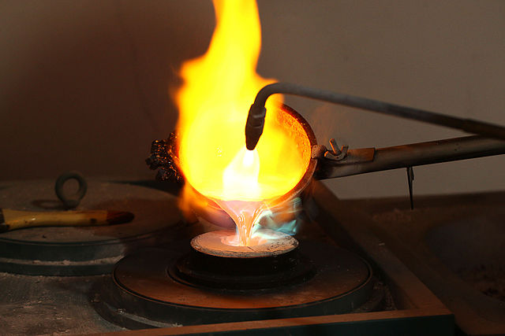

.. include:: ../common.rst

Numbers
=======

.. index::
   single: integer
   single: int
   single: double
   single: boolean
   single: String
   pair: variable; types
   pair: variable; primitive type
   pair: variable; object type
   pair: variable; integer
   pair: variable; floating point
   pair: variable; Boolean
   pair: variable; String

Mathmaticans distinguish between different kinds of numbers such as integers and
real numbers for purposes of classification. Computer programmers need to
distinguish between different kinds of numbers because numbers can be
represented different ways in a computer and can thus support different
operations or the same operations with slightly different meanings.

For the AP exam you only need to know about two of Java's numeric data types:
``int``\ s and ``double``\ s.

- The ``int`` data type, which you can probably guess is named for **integer**
  is used to represent integer values, i.e. positive and negative numbers with
  no fractional part such as ``3``, ``0``, ``-76``, and ``20393``.

- The ``double`` data type is used to represent non-integer numbers like ``6.3``
  ``-0.9``, and ``60293.93032``. Computer people call these “floating point”
  numbers because the decimal point “floats” relative to the magnitude of the
  number, similar to the way it does in scientific notation like :math:`6.5 ✕
  10^8`. The name ``double`` comes from the fact that ``double``\s are
  represented using 64 bits, double the 32 bits used for the type ``float``
  which used to be the normal size floating point number when most computers did
  math in units of 32-bits. (``float`` is rarely used these days and is not part
  of the AP curriculum.)

Literal numeric values
----------------------

In order to use ``int`` and ``double`` values in expressions we need to know how
to write their literal values. Luckily it’s pretty much what you are used to:

- Literal ``int``\ s are made up of just digits e.g. ``1`` or ``23``. Negative
  integers can be expressed with a ``-`` before a literal ``int``. We can’t use
  commas to group digits as in, *1,000,000* but we can use ``_``: ``1_000_000``
  represents the same value as ``1000000`` but is a lot easier to read. (This
  also points out another important difference between literal values and the
  actual values they represent: there may be different literals values, such as
  ``1_000_000`` and ``1000000`` that both represent the same actual value. There
  is no way once the program is running to know how the value was written. Two
  other ways to write that same value that are also legal in Java are as a
  **hexadecimal literal** ``0xf4240`` and a **binary literal**
  ``0b11110100001001000000`` though you do not need to know about those for the
  AP Exam.)

- Literal ``double``\ s are written with digits and a decimal point: ``1.0``,
  ``1.4142``, ``0.5``. They can also be written in a form a “computer scientific
  notation”: ``1.23e6`` is a the Java version of what we’d write in scientific
  notation as :math:`1.23 × 10^6`, also known as ``1_230_000.0``. Finally, for
  values less than ``1.0`` a leading ``0`` is not required but it’s often a bit
  more readable to include it, writing, for instance, ``0.5`` rather than just
  ``.5``. That’s a matter of taste though.

Note that because ``int`` and ``double`` are different data types their literal
values produce different values even when they’re mathematically the same. For
instance ``1`` and ``1.0`` represent different actual values; the first is an
``int`` and the second is a ``double``. We’ll see in the next section when this
difference matters.

Arithmetic expressions
----------------------

.. index::
    single: operators
    pair: math; operators
    pair: operators; addition
    pair: operators; subtraction
    pair: operators; multiplication
    pair: operators; division
    pair: operators; equality
    pair: operators; inequality

The set of operators that operate on ``int``\ s and ``double``\ s are the
standard arithmetic operations you learned about in elementary school: addition
(``+``), subtraction (``-``), and division (``/``), and multiplication (``*``).
Multiplication is written in Java as ``*``, as it is in many programming
languages, because until recently most computers’ character sets didn’t have a
character for a real multiplication sign, ``×``, and keyboards still don’t have
a key for it. Likewise the symbol ``÷`` is not an operator in Java.

.. note::

   There is no exponentiation operator in Java. You may be used to using ``^``
   for exponentiation, either from a graphing calculator or tools like Desmos.
   Confusingly ``^`` *is* an operator in Java but it has a completely different
   meaning than exponentiation and isn’t even exactly an arithmetic operator.
   Later we’ll learn about other ways to do more complex mathematical
   computations than are supported directly via numeric operators.

Each of these operators take two **operands**, the values that the operator uses
when computing a new value. When our program runs the operator will operate on
two actual values but in our program we write the operands as expressions that
produces values of the right types. For instance these are all arithmetic
expressions:

- ``1 + 2``

- ``10 - 20``

-  ``1.23 / 4.56``

- ``100 * 256``

- ``4 * 3 + 10``

In the first four expressions there is just one operator each and the operands
are all literal values. The last expression is what is called a **compound
expression** being an addition expression one of whese operands is another
expression, in this case the multiplication expression, ``4 * 3``.

The reason that expression is interpreted as ``4 * 3`` plus ``10`` rather than
``4`` times ``3 + 10`` is because the order of operations in Java follows is
similar to the PEMDAS order you probably learned in middle school:
multiplication and division happen before addition and subtraction. And, as in
PEMDAS, we can use parentheses to group expressions to change the normal order.
If we wanted the addition to happen first above, we could write ``4 * (3 +
10)``. It also doesn't hurt to put in extra parentheses if you are unsure as to
what will be done first or just to make it more clear.

Division
--------

Even though the set of arithmetic operators that operate on ``int``\ s and
``double``\ s are the same, their meanings are subtly different depending on the
types of values they are operating on. There are a two main rules:

- An arithmetic operator operating on expressions of the same type (i.e. both
  ``int`` or both ``double`` will produce a value of that same type.

- An arithmetic operator operating on mixed types (i.e. one ``int`` and one
  ``double``) will produce a ``double``. We sometimes say that ``double``\ s are
  contagious. When an arithmetic operator is applied to one ``int`` and one
  ``double`` the ``int`` value is first converted to the equvialent ``double``
  value, such as ``1`` being converted to ``1.0``.

For all the arithmetic operators except division this is simple: add two
``int``\ s and you get another ``int``; two ``double``\ s and you get a
``double``; no big deal. But since ``int`` values have no fractional part what
happens when we evaluate an expression like ``10 / 4``? Mathematically the
result is 2.5 but that can’t be represented by an ``int``. So there’s a special
rule for division: the ``/`` operator does what’s called a **truncating
division** meaning it just lops off the part of the true value after the decimal
point. Thus ``10 / 4`` produces the ``int`` value ``2``. Note that this is not
the same as rounding to the nearest ``int``: ``19 / 10`` evaluates to ``1`` even
though the mathematical value is much closer to ``2`` than ``1``. But truncating
1.9 throws away the 0.9 giving us ``1``. It works the same for negative numbers:
``-19 / 10`` truncates to ``-1``.

For ``double``\ s division works much more like we’d expect from math but not
exactly. ``10.0 / 4.0`` gives us ``2.5`` as we’d expect. However not all results
can be represented exactly, . ``1.0 / 3.0`` gives us ``0.3333333333333333``
which is pretty close but obviously not exactly the same as the mathematically
correct value. This is because ``double``\ s are very much like scientific
notation, meant to deal with both very small and very large values to a
reasonable but not infinite level of precision. In practice ``double``\ s can
represent value with approximately fifteen decimal places of accuracy.

Because of the differences between ``int`` and ``double`` division we need to be
careful about “double contagion” in division expressions: ``1 / 4`` gives us
``0`` but ``1.0 / 4`` or ``1 / 4.0`` give ``0.25``.

Finally division is the only arithmetic operator that isn’t defined for all
possible values since division by zero has no mathematical meaning. In ``int``
division, trying to divide by ``0`` will result in an **ArithmeticException**
which will crash your program and spit out an error message. You can try it in
one of the active code windows above. With ``double``\ s it produces a special
value ``Infinity`` which is maybe better than crashing but only by a bit in that
math breaks down at infinity: Infinity plus or times anything is still Infinity;
Infinity minus or divided by anything finite is Infinity, and Infinity minus or
divided by Infinity is an even weirder special value ``NaN`` which stands for
“Not a Number”. However you don’t need to know about these weird ``double``
values for the AP Exam.

Remainder
---------

Java supports one last arithmetic operator that you also probably learned about
in elementary school but not as a separate operator. The percent sign (``%``) is
the **remainder** operator. Like the other arithmetic operators is takes two
operands. Mathematically it returns the remainder after performing a truncating
integer division of the first number by the second. For instance, ``5 % 2``
evaluates to ``1`` since 2 goes into 5 two times with a remainder of 1.

While you may not have heard of remainder as an operator, think back to
elementary school math. Remember when you first learned long division, before
they taught you about decimals, how when you did a long division that didn’t
divide evenly, you gave the answer as the number of even divisions and the
remainder. That remainder is what is returned by this operator. In the figures
below, the remainders are the same values that would be returned by ``2 % 3``
and ``5 % 2``.

.. figure:: Figures/mod-py.png
    :width: 150px
    :align: center
    :figclass: align-center

    Figure 1: Long division showing the integer result and the remainder

.. note::

   Sometimes people—including Professor Lewis in the next video—will call ``%``
   the **modulo**, or **mod**, operator. That is not actually correct though the
   difference between remainder and modulo only matters when the signs of the
   operands differ, so usually it doesn’t matter. Having ``%`` mean remainder is
   quite common in programming languages. In some languages, however, ``%``
   actually *is* modulo. To compute ``a`` *modulo* ``b`` in Java, or any other
   language where ``%`` is remainder, you need to write ``(a % b) + b) % b`` or,
   better yet, use the method ``Math.floorMod`` from the ``Math`` class which
   we’ll learn about later. But on the AP exam, all the uses of ``%`` will be
   ones where this distinction doesn’t matter.

.. |video2| raw:: html

   <a href="https://www.youtube.com/watch?v=jp-T9lFISlI&ab_channel=colleenlewis" target="_blank">video</a>

Here’s the |video2|.

.. youtube:: jp-T9lFISlI
    :width: 700
    :height: 415
    :align: center

The cast operator
-----------------

One last operator we need to know abut is the **cast** operator which has no
analogue in math class because it has to do solely with how numbers are
represented in the computer. Because ``int`` and ``double`` are different data
types, their values are distinct even when they’re mathematically equivalent.
But sometimes we’ll have one and want the other. For instance, if we’re
computing an average score in a class on a ten-point quiz, the number of
students in the class would most reasonably be represented with an ``int``
(there are no fractional students) and assuming there’s no partial credit the
individual scores are also likely to be recorded is ``int``\ s. When we add up
those ``int``\s the total will thus also be an ``int``. But if we divide an
``int`` (the total) by an ``int`` (the number of students) we get a truncating
division which is not what we want.

That’s where the cast operator comes in. It’s not clear where the name “cast”
came from in programming but it’s probably rooted in the same idea as casting
bronze where molten bronze is reshaped by being “cast” in a mold. The cast
operator changes the shape (type) of the value it is applied to.

    Figure 1: Bronze casting changes the shape of the metal.

Unlike the arithmetic operators which operate on the value of two expressions
and is written between them, the cast operator operates on only one value and is
written before the expression that produces the value. It is written as a pair
of parentheses containing the name of the type of value we want, like ``(int)``
or ``(double)``. For example:

- ``(double) 19`` gives us the value ``19.0``.

- ``(int) 3.14`` gives us the value ``3``.

As you can see, casting an ``int`` value to ``double`` doesn’t lose any
information because all ``int``\ s have a mathematically equivalent ``double``
value. But casting a ``double`` value to ``int`` loses the fractional part,
truncating the number the same way results of ``int`` division get truncated.

Thus the two kinds of casts serve different purposes. Casting to an ``int`` is
mostly useful after you’ve done a complete calculation with ``double`` values
and want, at the end, to convert it to an integer value. Remember though that
truncation is not the same as rounding.

.. note::

   You can use a cast to ``int`` as part of an expression to round a ``double``
   within the range representable by ``int``\ s to the nearest ``int`` by adding
   or subtracting ``0.5`` before casting.

   For example, if we divide ``7.0 / 4.0`` we get ``1.75``. If we cast that to
   an ``int``, it will be truncated to ``1``. However if add ``0.5`` when the
   fractional part is greater than ``0.5``, as it is here, the result will be
   greater than the next ``int`` value and casting *that* value to an ``int``
   will truncate down. So in this case ``1.75 + 0.5`` gives us ``2.25`` which is
   then truncated to ``2``, the correctly rounded result. On the other hand
   adding ``0.5`` to the result of evaluating ``5.0 / 4.2``, namely ``1.25``,
   only gets us to ``1.75`` which truncates back to ``1`` which is also
   correctly rounded.

Casting to a ``double`` has a very different effect because of the rule about
double contaigon. Recall that in an expression involving one ``int`` and one
``double``, the ``int`` is first automatically converted to a ``double`` and
then the expression is evaluated using the rules of ``double`` math. Because of
this rule, casting one ``int`` value in an arithmetic expression to a ``double``
is enough to force the result to also be a ``double``. Thus ``(double) 19 / 10``
gives us ``1.9`` rather than ``1`` because it is equivalent to ``19.0 / 10``
which is equivalent to ``19.0 / 10.0``.

Obviously when we’re dealing with literal values it’s kind of silly to use casts
since if we wanted the value ``19.0`` we could just write that rather than
casting ``19`` to a ``double``. But the cast operator can be used on *any*
numeric expression to convert from one type of number to the other.

Note that the precedence of the cast operator higher than all the arithmetic
operators (but lower than parentheses) so ``(double) 19 / 10`` is equivalent to
``((double) 19) / 10``, i.e. the cast happens first and then the division.

Because of the high precedence of the cast operator, when we want to cast the
result of a ``double`` expression to ``int`` we need to explicitly parethesize
the expression whose value we want to cast. To see why, consider these two
expressions:

.. code-block:: java

   (int) (0.956 * 100.0)
   (int) 0.956 * 100.0

The first expression computes the ``double`` result of the multiplication giving
us ``95.6`` and the cast then truncates that down to the int ``95``. The second
expression, however, gets evaluated in a slightly more convoluted way. First the
cast converts ``0.956`` by truncation to the ``int 0``. *Then* because of double
contaigon that int value is converted back to a ``double`` before performing the
multiplication. But the fractional part has been lost so we get ``0.0 * 100.0``
resulting in the ``double`` value ``0.0``. Sometimes that might be what you want
but most often when casting to ``int`` you’ll want to use parentheses to group
the whole expression whose value you want to cast.

Summary
-------

- Arithmetic expressions include expressions of type ``int`` and ``double``.

- The arithmetic operators consist of ``+``, ``-``, ``*`` , ``/``, and ``%``
  also known as addition, subtraction, multiplication, division, and remainder.

- An arithmetic operation that uses two ``int`` values will evaluate to an
  ``int`` value. With integer division, any decimal part in the result will be
  thrown away.

- An arithmetic operation that uses at least one ``double`` value will evaluate
  to a ``double`` value.

- Operators can be used to construct compound expressions.

- During evaluation, operands are associated with operators according to
  **operator precedence** to determine how they are grouped. (``*``, ``/``,
  ``%`` have precedence over ``+`` and ``-``, unless parentheses are used to
  group those.)

- An attempt to divide an integer by zero will result in an ``ArithmeticException``.

- The assignment operator (``=``) allows a program to initialize or change the
  value stored in a variable. The value of the expression on the right is stored
  in the variable on the left.

- During execution, expressions are evaluated to produce a single value.

- The value of an expression has a type based on the types of the values and
  operators used in the expression.

- **Type casting** is used to convert value from one type to another.

- The casting operators ``(int)`` and ``(double)`` can be used to create a
  temporary value converted to a different data type.

- Casting a ``double`` value to an ``int`` causes the digits to the right of the
  decimal point to be truncated (cut off and thrown away).

- In expressions involving ``double``\ s, the ``double`` values are contagious,
  causing ``int``\ s in the expression to be automatically converted to the
  equivalent ``double`` value so the result of the expression can be computed as
  a ``double``.

- Values of type ``double`` can be rounded to the nearest integer by (int)(x +
  0.5) or (int)(x – 0.5) for negative numbers.

- Integer values in Java are represented by values of type ``int``, which are
  stored using a finite amount (4 bytes) of memory. Therefore, an int value must
  be in the range from ``Integer.MIN_VALUE`` to ``Integer.MAX_VALUE``,
  inclusive.

- If an expression would evaluate to an int value outside of the allowed range,
  an integer overflow occurs. This could result in an incorrect value within the
  allowed range.
