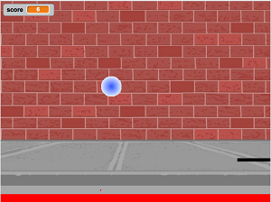

.. include:: ../common.rst

.. qnum::
   :prefix: 1-3-
   :start: 1

Variables and Data Types
========================

In this lesson, you will learn about variables and primitive data types.

What is a Variable?
-------------------

.. index::
   single: variable

A **variable** is a name associated with a memory location in the computer,
where you can store a value that can change or vary. The following `video
<https://youtu.be/pHgYlVjagmA>`_ explains what a variable is and gives a couple
of real word examples of variables.

.. youtube:: pHgYlVjagmA
    :width: 700
    :height: 400
    :align: center

When you play a game, it will often have a score. Scores often start at 0 and
increase, so they can change. A score can be stored in a variable.

    Figure 1: A pong game in `Scratch <http://scratch.mit.edu>`_ with a score shown in the upper left.

Declaring Variables in Java
---------------------------

.. index::
   single: bit
   single: binary digit
   single: declare
   pair: variable; declare

To create a variable, you must tell Java its data type and its name. Creating a
variable is also called **declaring a variable**. The type is a keyword like
``int``, ``double``, or ``boolean``, but you get to make up the name for the
variable. When you create a **primitive variable** Java will set aside enough
bits in memory for that primitive type and associate that memory location with
the name that you used.

The fact that you need to declare the type of a variable is one of the ways Java
differs from languages like Python, Javascript, and Snap! In those languages a
variable is just a name for a value and the value can be of any type. In Java
you have to say what type of value a variable will be used to name and the Java
compiler will make sure you never try to use a variable to hold a different kind
of variable. While it creates some extra work when declaring variables it also
helps avoid bugs caused by different parts of your program not agreeing on the
types of values they are working with.

Computers store all values using **bits** (binary digits). A **bit** can
represent two values and we usually say that the value of a bit is either 0
or 1. When you declare a variable, you have to tell Java the type of the
variable because Java needs to know how many bits to use and how to represent
the value. The 3 different primitive types all require different number of bits.
An integer gets 32 bits of memory, a double gets 64 bits of memory and a boolean
could be represented by just one bit.

.. figure:: Figures/typesAndSpace.png
    :width: 500px
    :figclass: align-center

    Figure 2: Examples of variables with names and values.  Notice that the different types get a different amount of memory space.

To **declare** (create) a variable, you  specify the type, leave at least one space, then the name for the variable and end the line with a semicolon (``;``). Java uses the keyword **int** for integer, **double** for a floating point number (a double precision number), and **boolean** for a Boolean value (true or false).

Here is an example declaration of a variable called score.

.. code-block:: java

  int score;

After declaring a variable, you can give it a value like below using an equals sign ``=`` followed by the value.

.. code-block:: java

  int score;
  score = 4;

Or you can set an initial value for the variable in the variable declaration. Here is an example that shows declaring a variable and initializing it all in a single statement.

.. code-block:: java

  int score = 4;

You can print the value of variables by passing them to ``System.out.print`` and
``System.out.println`` like this:

.. code-block:: java

   System.out.println(score);

You can also **concatenate** values with a ``String`` using the ``+`` operator.
Concatenation just means “smoosh together” so ``"Score: " + score`` is an
expression that smooshes together the string ``"Score: "`` with the value of the
variable ``score`` converted to a ``String``, giving us ``"Score: 4"``. We can
then print that new value like this:

.. code-block:: java

   System.out.println("Score: " + score);

Remember when you are trying to print the value of a variable you do *not* put
the name of the variable in quotes. ``score`` is the name of a variable;
``"score"`` is a string containing the word “score”.

If you want spaces between words and variables, you must put the spaces inside
the quotes of some ``String``. If you forget to add spaces, you will get smushed
output like ``Score:4`` instead of ``Score: 4``.

|CodingEx| **Coding Exercise:**

.. activecode:: lcdv2
   :language: java
   :autograde: unittest

   Run the following code to see what is printed. Then, change the values and
   run it again. Try adding quotes around some variables and removing spaces
   from some of the strings to see what happens.

   ~~~~
   public class Test2
   {
       public static void main(String[] args)
       {
           int score;
           score = 0;
           System.out.print("The score is ");
           System.out.println(score);

           double price = 23.25;
           System.out.println("The price is " + price);

           boolean won = false;
           System.out.println(won);
           won = true;
           System.out.println(won);

           String name = "Jose";
           System.out.println("Hi " + name);
       }
   }

   ====
   // should pass if/when they run code
   import static org.junit.Assert.*;

   import org.junit.*;

   import java.io.*;

   public class RunestoneTests extends CodeTestHelper
   {
       @Test
       public void testMain() throws IOException
       {
           String output = getMethodOutput("main");
           String expect =
                   "The score is 0\nThe price is 23.25\nfalse\ntrue\nHi Jose";
           boolean passed =
                   getResults(expect, output, "Expected output from main", true);
           assertTrue(passed);
       }
   }

The equal sign here ``=`` doesn't mean the same as it does in a mathematical
equation where it implies that the two sides are equal. Here it means set the
value in the memory location associated with the variable name on the left to a
*copy* of the value on the right. The first line above sets the value in the box
called score to 4. A variable always has to be on the left side of the ``=`` and
a value or expression on the right.

|Exercise| **Check Your Understanding**

.. clickablearea:: var_declare
    :question: Click on all of the variable declarations in the following code.
    :iscode:
    :feedback: Variable declarations start with a type and then a name.

    :click-incorrect:public class Test2:endclick:
    :click-incorrect:{:endclick:
        :click-incorrect:public static void main(String[] args):endclick:
        :click-incorrect:{:endclick:
            :click-correct:int numLives;:endclick:
            :click-incorrect:numLives = 0;:endclick:
            :click-incorrect:System.out.println(numLives);:endclick:
            :click-correct:double health;:endclick:
            :click-incorrect:health = 8.5;:endclick:
            :click-incorrect:System.out.println(health);:endclick:
            :click-correct:boolean powerUp;:endclick:
            :click-incorrect:powerUp = true;:endclick:
            :click-incorrect:System.out.println(powerUp);:endclick:
        :click-incorrect:}:endclick:
    :click-incorrect:}:endclick:

.. clickablearea:: var_init
    :question: Click on all of the variable initializations (first time the variable is set to a value) in the following code.
    :iscode:
    :feedback: Variables are initialized using name = value;

    :click-incorrect:public class Test2:endclick:
    :click-incorrect:{:endclick:
        :click-incorrect:public static void main(String[] args):endclick:
        :click-incorrect:{:endclick:
            :click-incorrect:int numLives;:endclick:
            :click-correct:numLives = 0;:endclick:
            :click-incorrect:System.out.println(numLives);:endclick:
            :click-correct:double health = 8.5;:endclick:
            :click-incorrect:System.out.println(health);:endclick:
            :click-correct:boolean powerUp = true;:endclick:
            :click-incorrect:System.out.println(powerUp);:endclick:
        :click-incorrect:}:endclick:
    :click-incorrect:}:endclick:

|CodingEx| **Coding Exercise:**

.. activecode:: lcdv3
   :language: java
   :autograde: unittest

   This assignment statement below is in the wrong order. Try to fix it to compile and run.
   ~~~~
   public class Test3
   {
       public static void main(String[] args)
       {
           int score;
           4 = score;
           System.out.println(score);
       }
   }

   ====
   // should pass if/when they run code
   import static org.junit.Assert.*;

   import org.junit.*;

   import java.io.*;

   public class RunestoneTests extends CodeTestHelper
   {
       @Test
       public void testMain() throws IOException
       {
           String output = getMethodOutput("main");
           String expect = "4";
           boolean passed =
                   getResults(expect, output, "Expected output from main");
           assertTrue(passed);
       }
   }

|Exercise| **Check Your Understanding**

.. fillintheblank:: fillDecVar1

   Fill in the following: [blank] age = [blank]; to declare age to be an integer and set its value to 5.

   -    :int: Correct.  You typically use whole numbers for ages after age 1.
        :.*: Remember that Java uses just the first 3 letters of integer
   -    :5: Correct.  You can initialize to a value.
        :.*: Use 5 in the second blank

.. fillintheblank:: fillDecVar2

   What type should you use for a shoe size like 8.5?

   -    :^\s*double$: Correct.  Any variable that needs to values after the decimal point should be declared as a double.
        :.*: What type allows for a decimal value

.. fillintheblank:: fillDecVar3

   What type should you use for a number of tickets?

   -    :^\s*int$: Correct. You can't buy half a ticket so this will be an integer.
        :.*: Use a type that represents whole numbers like 1, 2, 3, etc.

**Mixed up Code Problems**

.. parsonsprob:: declareVars1
   :numbered: left
   :adaptive:
   :noindent:

   The following code declares and initializes variables for storing a number of visits, a person's temperature, and if the person has insurance or not.  It also includes extra blocks that are not needed in a correct solution.  Drag the needed blocks from the left area into the correct order (declaring numVisits, temp, and hasInsurance in that order) in the right area.  Click on the "Check Me" button to check your solution.
   -----
   int numVisits = 5;
   =====
   Int numVisits = 5; #paired
   =====
   double temp = 101.2;
   =====
   Double temp = 101.2;  #paired
   =====
   boolean hasInsurance = false;
   =====
   Boolean hasInsurance = false; #paired

The keyword **final** can be used in front of a variable declaration to make it
a constant that cannot be changed. Constants are traditionally written in all
upper case.

.. code-block:: java

  final double PI = 3.14

|CodingEx| **Coding Exercise:**

.. activecode:: Testfn
   :language: java
   :autograde: unittest

   Try the following code and notice the syntax error when we try to change the constant PI. Put the comment symbols // in front of that line to remove the error and run it again.
   ~~~~
   public class TestFinal
   {
       public static void main(String[] args)
       {
           final double PI = 3.14;
           System.out.println(PI);
           PI = 4.2; // This will cause a syntax error
       }
   }

   ====
   // should pass if/when they run code
   import static org.junit.Assert.*;

   import org.junit.*;

   import java.io.*;

   public class RunestoneTests extends CodeTestHelper
   {
       @Test
       public void testMain() throws IOException
       {
           String output = getMethodOutput("main");
           String expect = "3.14";
           boolean passed =
                   getResults(expect, output, "Expected output from main", true);
           assertTrue(passed);
       }
   }

Naming Variables
--------------------

.. index::
   pair: variable; names

While you can name your variable almost anything, there are some rules.  A variable name should start with an alphabetic character (like a, b, c, etc.) and can include letters, numbers, and underscores ``_``. It must be all one word with no spaces.

You can't use any of the keywords or reserved words as variable names in Java (``for``, ``if``, ``class``, ``static``, ``int``, ``double``, etc).  For a complete list of keywords and reserved words, see https://docs.oracle.com/javase/specs/jls/se14/html/jls-3.html#jls-3.9.

The name of the variable should describe the data it holds. A name like
``score`` helps make your code easier to read. A name like ``x`` is not a good
in most contexts, because it gives no clues as to what kind of data it holds. On
the other hand, don’t name your variables crazy things like
``thisIsAReallyLongName``, especially on the AP exam. You want to make your code
easy to understand, not harder.

.. note::

   - Use meaningful variable names!

   - Start variable names with a lower case letter and use camelCase.

   - Variable names are case-sensitive and spelling matters. Each use of the
     variable in the code must match the variable name in the declaration
     exactly.

   - A variable name inside quotes is just a ``String`` not a reference to the
     variable.

.. index::
    single: camel case
    pair: variable; naming convention

The convention in Java and many programming languages is to always start a
variable name with a lower case letter and then capitalize the first letter of
each additional word, for example ``gameScore``. Since variable names can not
include spaces, capitalizing the first letter of each word after the first makes
it easier to read the name. This style is called **camel case** because it looks
like the humps of a camel. Another option is to use underscore to separate
words, known as **snake case**, so ``game_score`` rather than ``gameScore``. But
snake case it is almost never used in Java. (Programmers working in the language
Python—appropriately enough—almost always use snake case.)

.. activecode:: lcnv1
   :language: java
   :autograde: unittest

   Java is case sensitive so ``gameScore`` and ``gamescore`` are not the same.
   Run and fix the code below to use the right variable name.

   ~~~~
   public class CaseSensitiveClass
   {
       public static void main(String[] args)
       {
           int gameScore = 0; // variable name using camel case
           // this is using a different variable without camel case!
           System.out.println("gameScore is " + gamescore);
       }
   }

   ====
   import static org.junit.Assert.*;

   import org.junit.*;

   import java.io.*;

   public class RunestoneTests extends CodeTestHelper
   {
       @Test
       public void testMain() throws IOException
       {
           String output = getMethodOutput("main");
           String expect = "gameScore is 0\n";
           boolean passed =
                   getResults(expect, output, "Expected output from main", true);
           assertTrue(passed);
       }
   }

|Exercise| **Check Your Understanding**

.. fillintheblank:: fillName1

   What is the camel case variable name for a variable that represents a shoe size?

   -    :^\s*shoeSize$: Correct.  Start with the first word in all lowercase and uppercase the first letter of each additional word
        :.*: In camel case just appended the words after each other but uppercase the first letter of each word after the 1st word

.. fillintheblank:: fillName2

   What is the camel case variable name for a variable that represents the top score?

   -    :^\s*topScore$: Correct.
        :.*: In camel case just put the words after each other but uppercase the first letter of each word after the 1st word.

|Groupwork| Debugging Challenge : Weather Report
------------------------------------------------

.. activecode:: challenge1-3
   :language: java
   :autograde: unittest
   :practice: T

   Working in pairs, debug the following code. Can you find the all the bugs and get the code to run?
   ~~~~
   public class Challenge1_3
   {
      public static void main(String[] args)
      {
          int temperature = 70.5;
          double tvChannel = 101;
          boolean sunny = 1

          System.out.print("Welcome to the weather report on Channel ")
          System.out.println(TVchannel);
          System.out.print("The temperature today is );
          System.out.println(tempurature);
          System.out.print("Is it sunny today? ");
          System.out.println(sunny);
      }
   }

   ====
   import static org.junit.Assert.*;

   import org.junit.*;

   import java.io.*;

   public class RunestoneTests extends CodeTestHelper
   {
       @Test
       public void testMain() throws IOException
       {
           String output = getMethodOutput("main");
           String expect =
                   "Welcome to the weather report on Channel 101 \n"
                       + "The temperature today is 70.5\n"
                       + "Is it sunny today? true";
           boolean passed =
                   getResults(expect, output, "Expected output from main");
           assertTrue(passed);
       }
   }

Summary
-------------------

- A **variable** is a name for a memory location where you can store a value
  that can change or vary.

- A variable can be declared or declared and initialized as shown in the the
  following code:

  .. code-block:: java

    int score;
    double gpa = 3.5;

- **Data types** can be primitive types (like ``int``) or reference types (like
  ``String``).

- The three primitive data types used in this course are ``int`` (whole
  numbers), ``double`` (decimal numbers), and ``boolean`` (true or false).

- Each variable has associated memory that is used to hold its value.

- The memory associated with a variable of a primitive type holds an actual
  primitive value.

- When a variable is declared final, its value cannot be changed once it is
  initialized.

AP Practice
------------

.. mchoice:: AP1-3-1
   :practice: T
   :answer_a: int GPA; int numStudents;
   :answer_b: double GPA; int numStudents;
   :answer_c: double GPA; double numStudents;
   :answer_d: int GPA; boolean numStudents;
   :answer_e: double GPA; boolean numStudents;
   :correct: b
   :feedback_a: The average grade in GPA could be a decimal number like 3.5.
   :feedback_b: Yes, the average grade could be a decimal number, and the number of students is an integer.
   :feedback_c: The number of students is an integer number. Although it could be saved in a double, an int would be more appropriate.
   :feedback_d: The average grade in GPA could be a decimal number like 3.5. Booleans hold a true or false value, not numbers.
   :feedback_e: Booleans hold a true or false value, not numbers.

   Which of the following pairs of declarations are the most appropriate to store a student’s average course grade in the variable GPA and the number of students in the variable numStudents?
